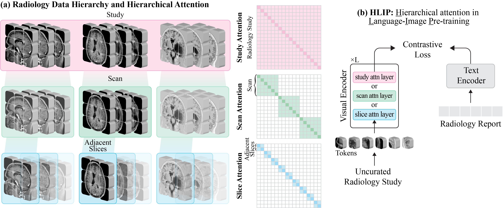

# HLIP
> Official PyTorch implementation of the following paper:\
> Towards Scalable Language-Image Pre-training for 3D Medical Imaging\
> University of Michigan\
> [](https://openreview.net/forum?id=WxHf4EcBWA)&nbsp; [](https://zch0414.github.io/hlip-ablation/)&nbsp; [](https://huggingface.co/collections/zch0414/hlip)&nbsp;


## Overview
<p align="center">
  
</p>

Directly leveraging uncurated clinical studies enables scalable language-image pre-training in 3D medical imaging, as the scale is no longer constrained by the manual effort required from clinicians to select a single representative scan or slice from each study. This paradigm could be more effective when equipped with a hierarchical attention mechanism inspired by the natural structure of the data: slice, scan, and study. We name this framework **H**ierarchical attention for **L**anguage-**I**mage **P**re-training (**HLIP**). For real-world clinical use, HLIP can be applied to studies containing either a single scan (e.g., chest CT) or multiple scans (e.g., brain MRI).

## Updates
- **(2026-04)**
  - We support **MR-RATE** and train <code>vit_base_scan_study_dualdinotxt1568</code> on the training split using its provided report supervision. This model achieves an AUC of 76.4 on the internal test split, and a balanced ACC of 89.1, 46.7, and 44.6 on the Pub-Brain-5 dataset's anomaly detection, tumor classification and diseases classification, respectively. The training command is provided in the Training section.
  - We test our <code>vit_large_slice_scan_study_dualdinotxt1568</code> [](https://huggingface.co/zch0414/clip-vit_base-slice_scan_study-dualdinotxt1568) on MR-RATE test split and achieve an **AUC of 80.3**. This model achieves a balanced ACC of 91.5, 57.1, and 64.7 on the Pub-Brain-5 dataset's anomaly detection, tumor classification and diseases classification, respectively.
  - We support **distributed evaluation** on all datasets, including CT-RATE, Rad-ChestCT, MR-RATE, Pub-Brain-5/Pub-Brain-5-GT, and RSNA.
  - We train <code>vit_base_slice_scan_dualdinotxt2744</code> on CT-RATE. The resulting model achieves an AUC of 79.8 on the internal CT-RATE evaluation and 71.8 on the external Rad-ChestCT evaluation. The training command is provided in the Training section.
  - If you need instructions for data processing or want to reproduce the results reported in the original paper, please refer to [v1.0](https://github.com/zch0414/hlip/tree/v1.0). We have removed all data processing instructions. We currently support only [itemized](https://github.com/MLNeurosurg/ItemizedCLIP/blob/main/Radiology_Tasks/src/open_ct_rate/itemized.json) supervision for training on the CT-RATE dataset. We have also updated the prompt templates used in all zero-shot evaluations. 
- **(2026-03)** Check out our new [paper](https://arxiv.org/abs/2512.11141), accepted at CVPR 2026. We introduce a new strategy, beyond the dual-loss approach presented in the HLIP blog, for handling itemized text supervision in language-image pre-training. The code and model weights are available [here](https://github.com/MLNeurosurg/ItemizedCLIP).
- **(2026-02)** 
  - HLIP is accepted by TMLR!
  - Assets in **2025-11 (departured)** have been finalized and updated. We apologize for any inconvenience to researchers actively using this repository. This should be our last incremental update to HLIP. We have released four HLIP variants in the Hugging Face collection: [](https://huggingface.co/collections/zch0414/hlip). The model released in **2025-11** is also included in this collection and is listed as [hlip-2025_10_08](https://huggingface.co/zch0414/hlip-2025_10_08). Technical details are provided in this [blog](https://zch0414.github.io/hlip-ablation/), and the implementation is based on this [code branch](https://github.com/Zch0414/hlip/tree/hlip-ablation). 
- ~~**(2025-11)** We release our updated model, along with a new code branch focused on uncurated 3D medical datasets. The technical details are described in this blog.~~
- **(2025-06)** Complete the initiation of HLIP repository.
- **(2025-05)** Release HLIP models trained on chest CT and brain MRI, feel free to try our demos.

## Getting Started

### Install 
[open-clip](https://github.com/mlfoundations/open_clip/tree/main)
```bash
python3 -m venv env
source env/bin/activate
pip install -U pip
pip install torch==2.5.1 torchvision==0.20.1 torchaudio==2.5.1 --index-url https://download.pytorch.org/whl/cu121
git clone git@github.com:mlfoundations/open_clip.git
cd open_clip
make install
make install-training
```

### Models
Models are released on HuggingFace and announced in the **Updates** section.

### Evaluation
CT-RATE
```bash
torchrun --rdzv_endpoint=localhost:29500 --nproc_per_node 4 zeroshot_ctrate.py \
  --model clip_vit_base_slice_scan_dualdinotxt2744 \
  --resume /path/to/clip_vit_base_slice_scan_dualdinotxt2744.pt \
  --data-root /data/ct_rate/valid/ \
  --input-file ../../data/ct_rate/valid_labels.csv \
```

Rad-ChestCT
```bash
torchrun --rdzv_endpoint=localhost:29500 --nproc_per_node 4 zeroshot_radchestct.py \
  --model clip_vit_base_slice_scan_dualdinotxt2744 \
  --resume /path/to/clip_vit_base_slice_scan_dualdinotxt2744.pt \
  --data-root /data/rad_chestct/ \
  --input-file ../../data/rad_chestct/rad_chestct_labels.csv \
```

MR-RATE
```bash
torchrun --rdzv_endpoint=localhost:29500 --nproc_per_node 8 zeroshot_mrrate.py \
  --huggingface zch0414/clip-vit_large-scan_study-dualdinotxt1568 \
  --data-root /data/mr_rate/ \
  --input-file ../../data/mr_rate/mr_rate_test.csv
```

Pub-Brain-5
```bash
torchrun --rdzv_endpoint=localhost:29500 --nproc_per_node 8 zeroshot_pubbrain5.py \
  --huggingface zch0414/clip-vit_large-scan_study-dualdinotxt1568 \
  --data-root /data/pub_brain_5/ \
  --input-file ../../data/pub_brain_5/pub_brain_5.csv
```

RSNA
```bash
torchrun --rdzv_endpoint=localhost:29500 --nproc_per_node 8 zeroshot_rsna.py \
  --huggingface zch0414/clip-vit_large-scan_study-dualdinotxt1568 \
  --data-root /data/rsna/ \
  --input-file ../../data/rsna/rsna.csv
```

CQ500
```bash
torchrun --rdzv_endpoint=localhost:29500 --nproc_per_node 8 zeroshot_cq500.py \
  --huggingface zch0414/clip-vit_large-scan_study-dualdinotxt1568 \
  --data-root /data/cq500/ \
  --input-file ../../data/cq500/cq500.csv
```

### Training
CT-RATE
```bash
torchrun --rdzv_endpoint=localhost:29500 --nproc_per_node 4 main.py \
  --benchmark-type ct-rate \
  --logs-dir /path/to/logs/ \
  --zeroshot-frequency 1 \
  --save-frequency 1 \
  --train-data /path/to/ct_rate/train/ \
  --train-file ../../data/ct_rate/ct_rate_train.json \
  --image-process-cfg -1150 350 crop \
  --text-process-cfg "sentence and report" \
  --ct-rate data_root='"/path/to/ct_rate/valid/"' input_file='"../../data/ct_rate/ct_rate_valid.csv"' \
  --rad-chestct data_root='"/path/to/rad_chestct/"' input_file='"../../data/rad_chestct/rad_chestct_labels.csv"' \
  --report-to wandb \
  --wandb-project-name hlip \
  --warmup 100 \
  --batch-size 32 \
  --accum-batch 4 \
  --lr=1e-4 \
  --wd=0.2 \
  --force-patch-dropout 0.0 \
  --epochs=30 \
  --precision amp \
  --workers 4 \
  --local-loss \
  --gather-with-grad \
  --grad-checkpointing \
  --model clip_vit_base_slice_scan_dualdinotxt2744 \
  --use-cxr-bert \
  --lock-text \
  --dist-url "env://localhost:29500"
```
Training for 30 epochs takes approximately 7.5 hours on a single node with 4 A40 GPUs. The best checkpoints come from approximately 15 epochs of training.


MR-RATE
```bash
torchrun --rdzv_endpoint=localhost:29500 --nproc_per_node 8 main.py \
  --benchmark-type mr-rate \
  --logs-dir /path/to/logs/ \
  --zeroshot-frequency 1 \
  --save-frequency 1 \
  --train-data /path/to/mr_rate/ \
  --train-file ../../data/mr_rate/train.json \
  --valid-data /path/to/mr_rate/ \
  --valid-file ../../data/mr_rate/valid.json \
  --num-scans 6 \
  --text-process-cfg "sentence and findings" \
  --report-to wandb \
  --wandb-project-name hlip \
  --warmup 2400 \
  --batch-size 16 \
  --accum-batch 2 \
  --lr=2e-4 \
  --wd=0.2 \
  --force-patch-dropout 0.0 \
  --epochs=40 \
  --precision amp \
  --workers 8 \
  --local-loss \
  --gather-with-grad \
  --grad-checkpointing \
  --model clip_vit_base_scan_study_dualdinotxt1568 \
  --dist-url "env://localhost:29500"
```
Training for 40 epochs takes approximately 16 hours on a single node with 8 L40 GPUs. We evaluate the checkpoint from epoch 30.


Our training implementation is closely aligned with [open-clip](https://github.com/mlfoundations/open_clip/tree/main), allowing us to leverage features such as <code>patch dropout</code> and <code>siglip</code>.

For <code>patch dropout</code>, try the following commands:
```bash
  --force-patch-dropout 0.5 \
  --beta2 0.95
```

For <code>siglip</code>, you can try it using the following commands, but make sure to modify the model configuration beforehand:
```bash
  --beta2 0.95 \
  --siglip
```

## Citation
If you find this repository helpful, please consider citing:
```bib
@article{zhao2026towards,
  title={Towards Scalable Language-Image Pre-training for 3D Medical Imaging},
  author={Chenhui Zhao and Yiwei Lyu and Asadur Zaman Chowdury and Edward S Harake and Akhil Kondepudi and Akshay T Rao and Xinhai Hou and Honglak Lee and Todd C Hollon},
  journal={Transactions on Machine Learning Research},
  issn={2835-8856},
  year={2026},
  url={https://openreview.net/forum?id=WxHf4EcBWA}
}
```
